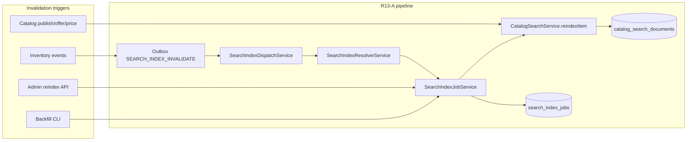

# R13-A Search indexing kernel + async pipeline

**CR:** `CR-R13-A-IMPL-225`  
**Verdict:** `R13_A_IMPLEMENTED`  
**Next authorization:** `CR-POST-R13-A-AUDIT-226`  
**Authority:** [223](223_R13_IMPLEMENTATION_PLAN.md) · [224](224_POST_R13_PLAN_AUDIT.md) · [93](93_GLOBAL_IMPLEMENTATION_ROADMAP.md)

R13-A delivers the **Postgres-first search indexing kernel** and **outbox-driven async reindex pipeline** for commerce catalog documents. It reuses `CatalogSearchDocument`, the existing outbox/BullMQ worker kernel, and `CatalogSearchService` — no duplicate search/outbox kernel. **R13-B+ (discovery API, recommendations, analytics, provider indexes, clinical search) are NOT started.**

---

## 1. Scope delivered

| Item | Status |
|------|--------|
| `search_index_jobs` persistence + enums | **DONE** |
| Async/outbox invalidation pipeline | **DONE** |
| Inventory event → catalog reindex resolver | **DONE** |
| `CatalogSearchService` version increment + worker-context writes | **DONE** |
| Admin API: `POST /admin/search/reindex`, `GET /admin/search/jobs` | **DONE** |
| Backfill CLI `search-reindex.cli.ts` | **DONE** |
| `catalog_search_documents` SELECT RLS tighten (PD-R13-03) | **DONE** |
| `search:admin` RBAC + security event | **DONE** |
| Focused `r13a.search-indexing.e2e` | **DONE** |
| R12 regression preservation | **DONE** 32/32 |

**Explicitly NOT started:** R13-B/C/D/E/F/G/H, R10-E/F, R14+, external search vendor, ML/recommendations, symptom-to-drug search, clinical/PHI indexing, provider discovery indexes.

---

## 2. Architecture

**Indexing write path:** all `reindexItem` calls run under `workerTenantContext({ countryId })` so Prisma `upsert` RETURNING is permitted while SELECT remains tightened for user/auth actors (unpublished rows are not readable cross-scope).

**Idempotency:** `search_index_jobs.idempotency_key` unique; duplicate schedule returns existing SUCCEEDED job unless `force=true`.

**Concurrency:** RUNNING jobs are not double-started; failed jobs retry on next schedule.

---

## 3. Files changed

### New — `apps/api/src/search/`

| File | Purpose |
|------|---------|
| `search.module.ts` | Nest module wiring |
| `search-index-job.service.ts` | Job CRUD, run, backfill |
| `search-index-resolver.service.ts` | Map inventory/invalidation events → catalog targets |
| `search-index-dispatch.service.ts` | Register handlers on `EventHandlerRegistry` |
| `admin-search.controller.ts` | Admin reindex + job list |
| `search-reindex.cli.ts` | Country backfill CLI |
| `r13a.search-indexing.e2e.spec.ts` | Focused R13-A e2e |

### Modified — API

| File | Change |
|------|--------|
| `apps/api/src/catalog/search.service.ts` | Worker-context reindex; `version` increment |
| `apps/api/src/catalog/catalog.module.ts` | Export `CatalogSearchService` |
| `apps/api/src/app/app.module.ts` | Import `SearchModule` |
| `apps/api/src/events/envelope.ts` | `SEARCH_INDEX_INVALIDATE` event |
| `apps/api/src/identity/authority.ts` | `search:admin` permission |
| `apps/api/src/identity/rbac.service.ts` | Grant `search:admin` to platform roles |
| `apps/api/src/identity/security-events.service.ts` | `SEARCH_REINDEX_REQUESTED` |

### Database

| File | Purpose |
|------|---------|
| `packages/database/prisma/schema.prisma` | `SearchIndexJob`, enums, `version` on `CatalogSearchDocument` |
| `20260829260000_r13a_search_schema` | Table + version column |
| `20260829260100_r13a_search_rls` | FORCE RLS; tighten catalog SELECT; job policies |
| `20260829260200_r13a_search_grants` | Least-privilege grants |
| `20260829260300_r13a_search_rls_fix` | (superseded by 604 for writes) |
| `20260829260400_r13a_search_rls_select_only` | PD-R13-03: SELECT-only tighten; preserve user/worker writes |

---

## 4. Database / migration / RLS

**Migrations applied:** 114 total (5 new R13-A: `260000`–`260400`).

### `search_index_jobs`

- FORCE RLS, deny-by-default
- SELECT: `is_worker()` OR `is_platform()` OR `can_country(country_id)`
- INSERT/UPDATE: worker/platform + `can_country(country_id)`
- DELETE: denied (`USING(false)`)
- Grants: `SELECT, INSERT, UPDATE` to `worldpharma_app`

### `catalog_search_documents` (PD-R13-03)

| Operation | Policy |
|-----------|--------|
| SELECT | worker/platform OR (`published=true` AND auth) OR (`published=true` AND user AND `can_country`) |
| INSERT | platform OR worker OR user/worker actor |
| UPDATE | platform OR worker OR user actor |
| DELETE | denied |

**No `USING(true)`** on R13-A objects.

---

## 5. Security / PHI assessment

| Control | Result |
|---------|--------|
| Country isolation | **PASS** — `can_country` on SELECT; worker scoped by country |
| No PHI in index payload | **PASS** — catalog title/body/SKU only; e2e asserts no clinical tokens |
| No symptom-to-drug / ML | **PASS** — not implemented |
| No external search vendor | **PASS** — Postgres ILIKE on `catalog_search_documents` |
| Admin reindex RBAC | **PASS** — `search:admin`; 401/403 negatives in e2e |
| R12/R11/R10/R9 boundaries | **PASS** — no clinical tables touched |
| Indexing under worker context | **PASS** — prevents user RETURNING leak on unpublished rows |

**PD-R13-01 (mobile `/catalog/search` vs web `/catalog/items`):** documented; R13-B must unify discovery — **not in R13-A**.

**PD-R13-02 (R13-G clinical search):** remains optional/legal-gated — **not implemented**.

---

## 6. Test counts

| Suite | Tests | Result | Classification |
|-------|-------|--------|----------------|
| `r13a.search-indexing.e2e` | 1 | **PASS** | R13-A focused |
| `catalog.e2e` (regression) | 1 | **PASS** | Blocker if failed |
| R12 combined (`r12a`–`r12g`) | 32 | **32/32 PASS** | Blocker if failed |
| **R13-A gate total** | **34** | **34/34 PASS** | |

**Failures:** none (blocker or non-blocker).

---

## 7. Typecheck / build

| Target | Result |
|--------|--------|
| `nx run api:typecheck` | **PASS** |
| `nx run api:build` | **PASS** (webpack compiled successfully) |

---

## 8. Runtime verification

| Check | Result |
|-------|--------|
| Migrations deploy | **PASS** — 114 applied, 0 pending |
| Admin reindex → SUCCEEDED job | **PASS** — r13a e2e |
| Idempotent duplicate schedule | **PASS** — r13a e2e |
| Inventory event → reindex job | **PASS** — r13a e2e |
| Catalog vendor offer create + inline reindex | **PASS** — catalog.e2e |
| Wrong-country catalog search | **PASS** — `country_enabled=false` |

---

## 9. Technical debt

| ID | Item | Severity |
|----|------|----------|
| TD-R13A-01 | Catalog inline reindex remains synchronous on publish/offer paths (async path additive) | Non-blocker |
| TD-R13A-02 | Prisma upsert RETURNING requires worker context for indexing writes | Resolved in impl |
| PD-R13-01 | Mobile uses `/catalog/search`; unified discovery deferred to R13-B | Planning |
| PD-R13-02 | R13-G clinical search optional vs closure criteria | Planning |

---

## 10. Boundary verification

| Phase | Status |
|-------|--------|
| R12-A…H | **COMPLETE** (32/32 regression green) |
| **R13-A** | **IMPLEMENTED** |
| R13-B/C/D/E/F/G/H | **NOT STARTED** |
| R10-E/F | **NOT STARTED** |
| R14+ | **NOT STARTED** |

---

## 11. API surface (R13-A only)

| Method | Path | Permission |
|--------|------|------------|
| POST | `/api/v1/admin/search/reindex` | `search:admin` |
| GET | `/api/v1/admin/search/jobs` | `search:admin` |

**CLI:** `npx ts-node …/search-reindex.cli.ts --country=XX [--locale=en]`

---

## 12. Next authorization

**`CR-POST-R13-A-AUDIT-226`** — post-R13-A implementation audit before R13-B.
